# Courese 3: Python Project for Data Engineering  

Pls see [here](https://www.coursera.org/learn/python-project-for-data-engineering/home/week/1) for Course 3 from [IBM Data Engineering Professional Certificate](https://www.coursera.org/programs/content-advisors-cu78y/professional-certificates/ibm-data-engineer).  

Below are my notes from Course 3.  

## Contents

- 3.1 Extract, Transform, Load (ETL)
- 3.2 Final Project

## 3.1 Extract, Transform, Load (ETL)

See [3.1 Extract, Transform, Load (ETL)](https://www.coursera.org/learn/python-project-for-data-engineering/lecture/GkBo7/extract-transform-load-etl) on Cousera.  

In this part, we will be able to:
- Define the Extract, Transform, Load process or ETL process  
- Explain the correct order of ETL functions   
- Write a simple ETL program   

So ETL, it is the process of extracting large amounts of data from multiple sources and formats. Then transforming it into one specific fromat before loading it into a database or target file

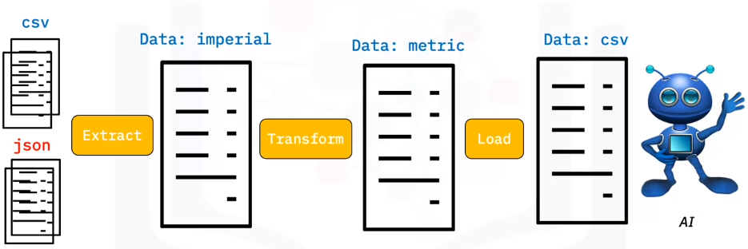

### Let's implement the following ETL with Python

#### Composite functions

We will discuss about **Glob** functions from **Glob module**.  
The input is the file extension and the output is a list of files with that particular extension.

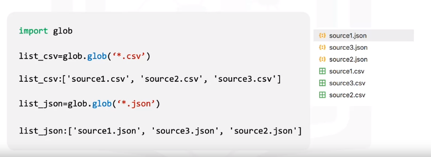

**Example for function Extract**  

- Extract CSV:  

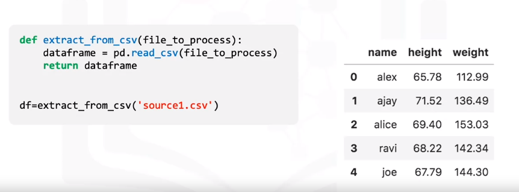  

- Extract JSON:

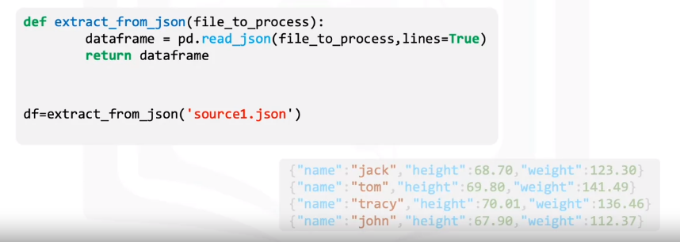  

- Extract Function:

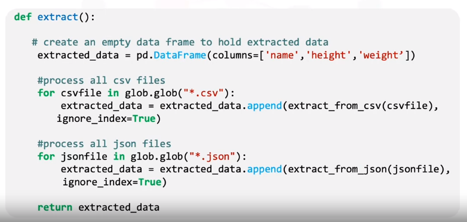  

Let’s see how the parameter “ignore index” sets the index in the order each column was appended to the data frame. 

We will look at the output extracted data. 

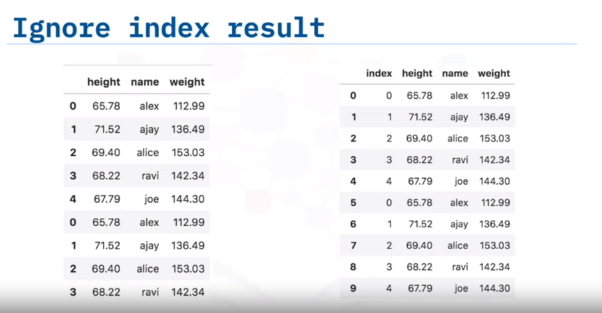  

- If we did not set the parameter “ignore_index” to true, then the index of the data frame “extracted_data” would be the same as the row Number of the original file. 
- If we set the “ignore index” to true, then the order of each row would be the same as the order the row was appended to the data frame. 

#### Transform

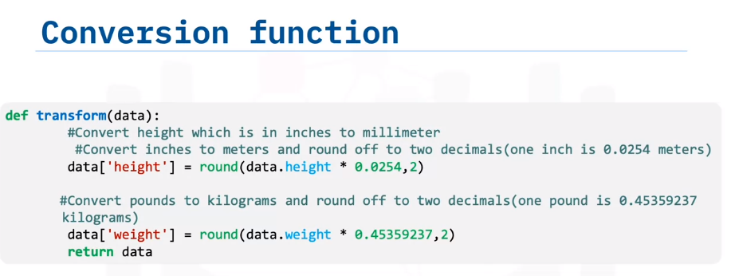

This function will convert the column height, which is in inches to millimeters, and the column pounds to kilograms, and return the output in the variable data.

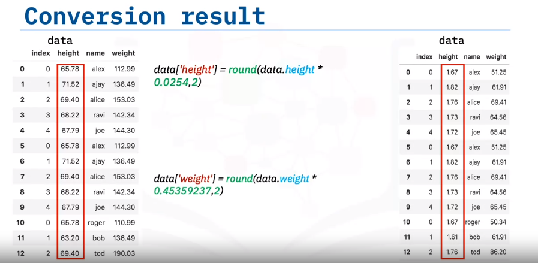

#### Loading and Logging

Now that we have collected and defined the data, it is time to load it into the targetfile. In this case, we save the pandas data frame as a CSV.

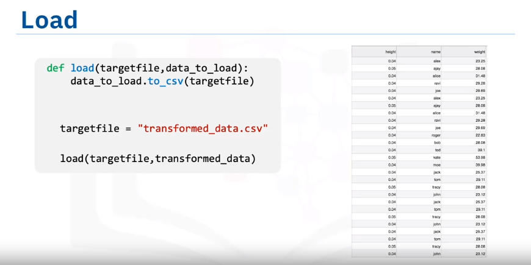

Before completing our task, we need to create a logging entry. To do this, we will create a logging function.

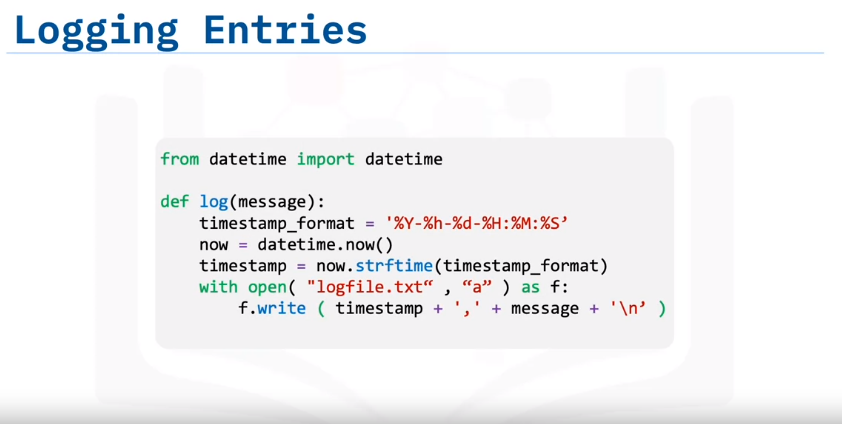

Now that we have defined all of the code necessary to run the ETL process on the selected data, the last thing we need to do is call all of functions.

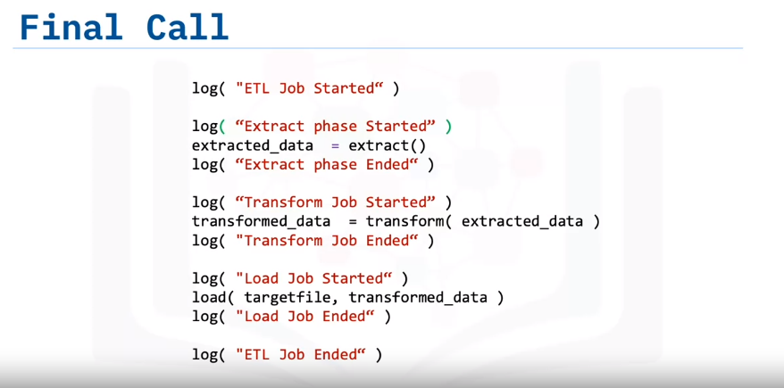

