# Courese 3: Python Project for Data Engineering  

Pls see [here](https://www.coursera.org/learn/python-project-for-data-engineering/home/week/1) for Course 3 from [IBM Data Engineering Professional Certificate](https://www.coursera.org/programs/content-advisors-cu78y/professional-certificates/ibm-data-engineer).  

Below are my notes from Course 3.  

## Contents

- 3.1 Extract, Transform, Load (ETL)
- 3.2 Final Project

## 3.1 Extract, Transform, Load (ETL)

See [3.1 Extract, Transform, Load (ETL)](https://www.coursera.org/learn/python-project-for-data-engineering/lecture/GkBo7/extract-transform-load-etl) on Cousera.  

In this part, we will be able to:
- Define the Extract, Transform, Load process or ETL process  
- Explain the correct order of ETL functions   
- Write a simple ETL program   

So ETL, it is the process of extracting large amounts of data from multiple sources and formats. Then transforming it into one specific fromat before loading it into a database or target file

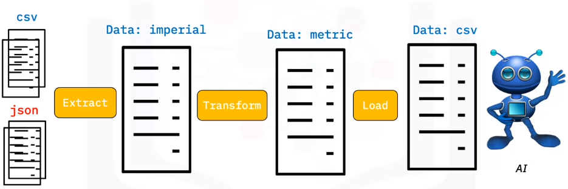

### Let's implement the following ETL with Python

#### Composite functions

We will discuss about **Glob** functions from **Glob module**.  
The input is the file extension and the output is a list of files with that particular extension.

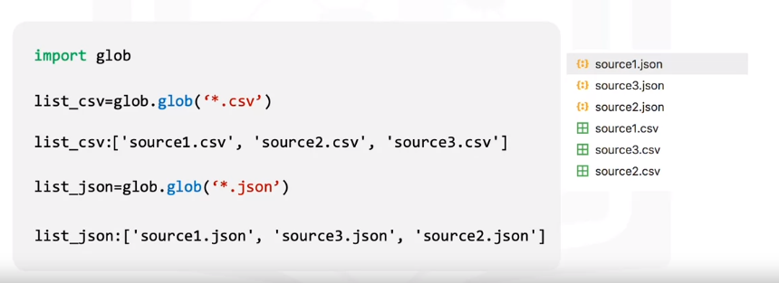

**Example for function Extract**  

- Extract CSV:  

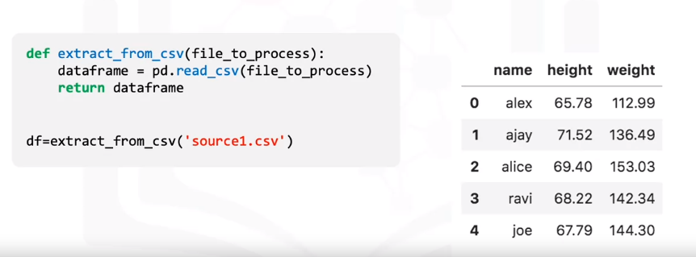  

- Extract JSON:

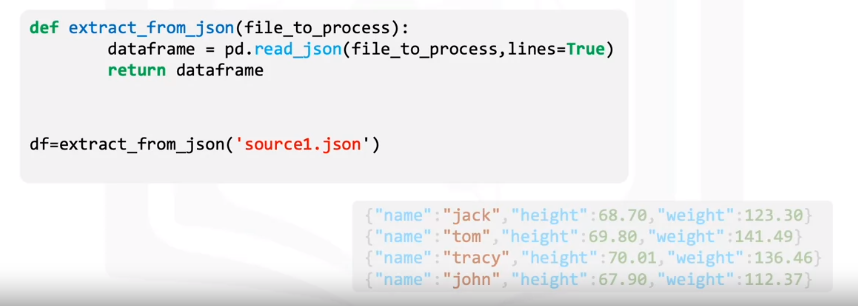  

- Extract Function:

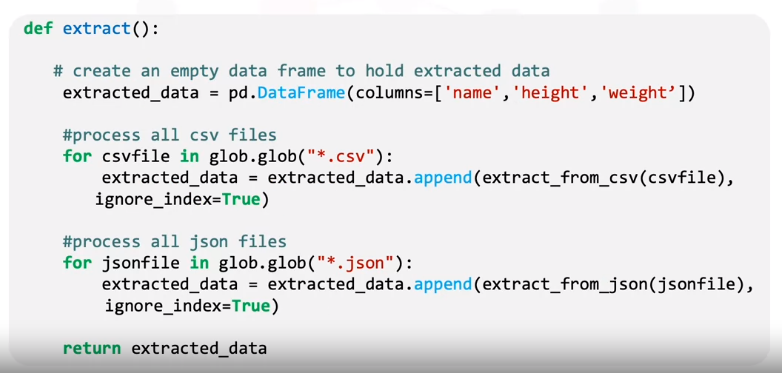  

Let’s see how the parameter “ignore index” sets the index in the order each column was appended to the data frame. 

We will look at the output extracted data. 

  

- If we did not set the parameter “ignore_index” to true, then the index of the data frame “extracted_data” would be the same as the row Number of the original file. 
- If we set the “ignore index” to true, then the order of each row would be the same as the order the row was appended to the data frame. 

#### Transform

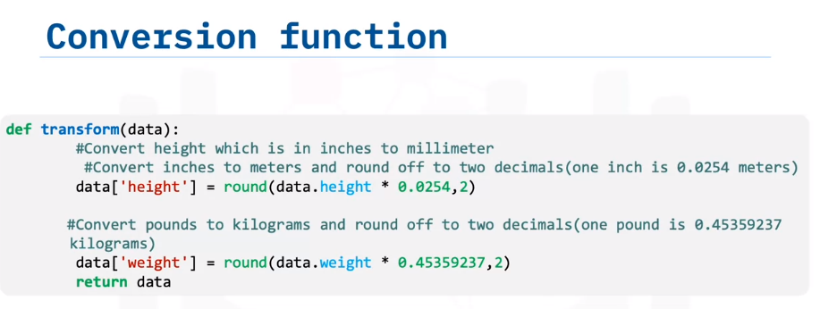

This function will convert the column height, which is in inches to millimeters, and the column pounds to kilograms, and return the output in the variable data.

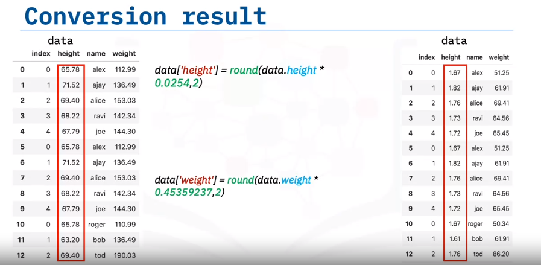

#### Loading and Logging

Now that we have collected and defined the data, it is time to load it into the targetfile. In this case, we save the pandas data frame as a CSV.

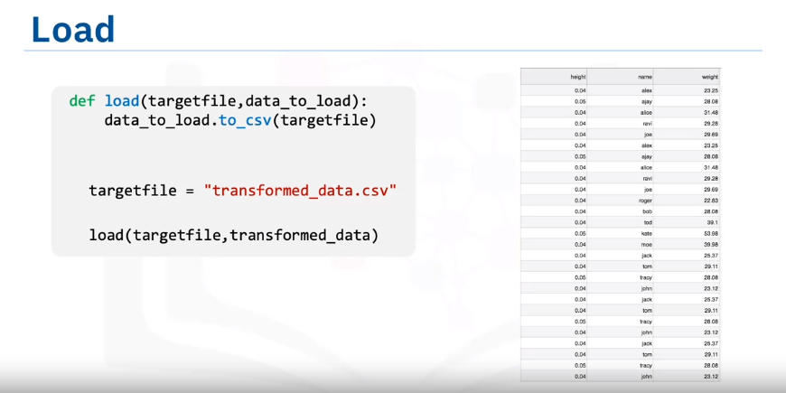

Before completing our task, we need to create a logging entry. To do this, we will create a logging function.


Now that we have defined all of the code necessary to run the ETL process on the selected data, the last thing we need to do is call all of functions.

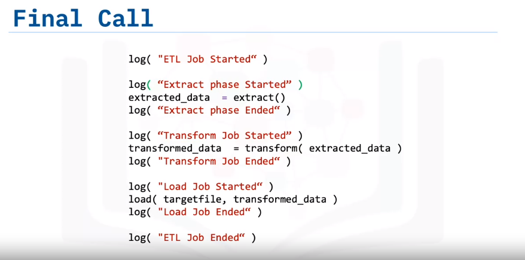

### Summary

In this part, we learned:

- How to write a simple Extract function.  
- How to write a simple Transform function.   
- How to write a simple Load function.   
- How to write a simple Logging function.

### Exercise

Run jupyter notebook and create a new ipykernel with name is `ETL.ipynb` 
Import the required modules and functions  
```
import glob                         # this module helps in selecting files 
import pandas as pd                 # this module helps in processing CSV files
import xml.etree.ElementTree as ET  # this module helps in processing XML files.
from datetime import datetime
```

#### Download files:  

```
!wget https://cf-courses-data.s3.us.cloud-object-storage.appdomain.cloud/IBMDeveloperSkillsNetwork-PY0221EN-SkillsNetwork/labs/module%206/Lab%20-%20Extract%20Transform%20Load/data/source.zip
```

This is the result:
```
--2023-07-14 18:13:06--  https://cf-courses-data.s3.us.cloud-object-storage.appdomain.cloud/IBMDeveloperSkillsNetwork-PY0221EN-SkillsNetwork/labs/module%206/Lab%20-%20Extract%20Transform%20Load/data/source.zip
Resolving cf-courses-data.s3.us.cloud-object-storage.appdomain.cloud (cf-courses-data.s3.us.cloud-object-storage.appdomain.cloud)... 169.45.118.108
Connecting to cf-courses-data.s3.us.cloud-object-storage.appdomain.cloud (cf-courses-data.s3.us.cloud-object-storage.appdomain.cloud)|169.45.118.108|:443... connected.
HTTP request sent, awaiting response... 200 OK
Length: 2707 (2,6K) [application/zip]
Saving to: ‘source.zip’

source.zip          100%[===================>]   2,64K  --.-KB/s    in 0s      

2023-07-14 18:13:07 (2,01 GB/s) - ‘source.zip’ saved [2707/2707]
```

In the same folder, we will see the file zip whit name `source.zip`

#### Unzip Files

```
!unzip source.zip
```

The result:
```
Archive:  source.zip
  inflating: source3.json            
  inflating: source1.csv             
  inflating: source2.csv             
  inflating: source3.csv             
  inflating: source1.json            
  inflating: source2.json            
  inflating: source1.xml             
  inflating: source2.xml             
  inflating: source3.xml         
```

#### Set paths

```
tmpfile    = "temp.tmp"               # file used to store all extracted data
logfile    = "logfile.txt"            # all event logs will be stored in this file
targetfile = "transformed_data.csv"   # file where transformed data is stored
```

#### Extract

##### CSV Extract Function

```
def extract_from_csv(file_to_process):
    dataframe = pd.read_csv(file_to_process)
    return dataframe
```

##### JSON Extract Function

```
def extract_from_json(file_to_process):
    dataframe = pd.read_json(file_to_process,lines=True)
    return dataframe
```

##### XML Extract Function

```
def extract_from_xml(file_to_process):
    dataframe = pd.DataFrame(columns=["name", "height", "weight"])
    tree = ET.parse(file_to_process)
    root = tree.getroot()
    for person in root:
        name = person.find("name").text
        height = float(person.find("height").text)
        weight = float(person.find("weight").text)
        dataframe = dataframe.append({"name":name, "height":height, "weight":weight}, ignore_index=True)
    return dataframe
```

##### Extract Function

```
def extract():
    extracted_data = pd.DataFrame(columns=['name','height','weight']) # create an empty data frame to hold extracted data
    
    #process all csv files
    for csvfile in glob.glob("*.csv"):
        extracted_data = extracted_data.append(extract_from_csv(csvfile), ignore_index=True)
        
    #process all json files
    for jsonfile in glob.glob("*.json"):
        extracted_data = extracted_data.append(extract_from_json(jsonfile), ignore_index=True)
    
    #process all xml files
    for xmlfile in glob.glob("*.xml"):
        extracted_data = extracted_data.append(extract_from_xml(xmlfile), ignore_index=True)
        
    return extracted_data
```

#### Transform

```
def transform(data):
        #Convert height which is in inches to millimeter
        #Convert the datatype of the column into float
        #data.height = data.height.astype(float)
        #Convert inches to meters and round off to two decimals(one inch is 0.0254 meters)
        data['height'] = round(data.height * 0.0254,2)
        
        #Convert weight which is in pounds to kilograms
        #Convert the datatype of the column into float
        #data.weight = data.weight.astype(float)
        #Convert pounds to kilograms and round off to two decimals(one pound is 0.45359237 kilograms)
        data['weight'] = round(data.weight * 0.45359237,2)
        return data
```

#### Loading

```
def load(targetfile,data_to_load):
    data_to_load.to_csv(targetfile)  
```

#### Logging

```
def log(message):
    timestamp_format = '%Y-%h-%d-%H:%M:%S' # Year-Monthname-Day-Hour-Minute-Second
    now = datetime.now() # get current timestamp
    timestamp = now.strftime(timestamp_format)
    with open("logfile.txt","a") as f:
        f.write(timestamp + ',' + message + '\n')
```

### Running ETL Process

```
log("ETL Job Started")
```

In the `logfile.txt`, we will see the line like this `2023-Jul-14-18:29:24,ETL Job Started`  

```
log("Extract phase Started")
extracted_data = extract()
log("Extract phase Ended")
extracted_data
```
The result:  

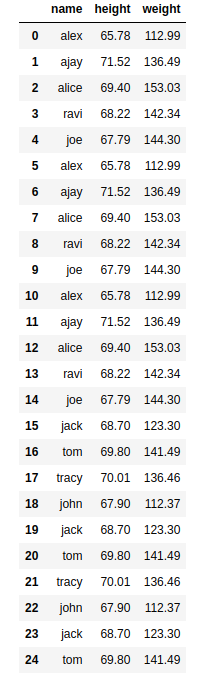  

In the `logfile.txt`, we will see appear 2 line like this:
>2023-Jul-14-18:32:03,Extract phase Started
>2023-Jul-14-18:32:03,Extract phase Ended


```
log("Transform phase Started")
transformed_data = transform(extracted_data)
log("Transform phase Ended")
transformed_data 
```
The result: 

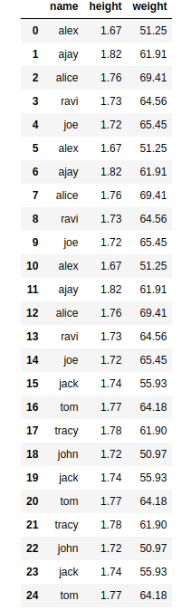  

In the `logfile.txt`, we will see appear 2 line like this:

>2023-Jul-14-18:37:46,Transform phase Started
>2023-Jul-14-18:37:46,Transform phase Ended


```
log("Load phase Started")
load(targetfile,transformed_data)
log("Load phase Ended")
```
In the `logfile.txt`, we will see appear 2 line like this:
>2023-Jul-14-18:40:14,Load phase Started
>2023-Jul-14-18:40:14,Load phase Ended

In the same folder, we should see the file: `transformed_data.csv`  

```
log("ETL Job Ended")
```
In the `logfile.txt`, we will see appear 1 line like this:
>2023-Jul-14-18:41:19,ETL Job Ended


Okay, well done. We completed.
